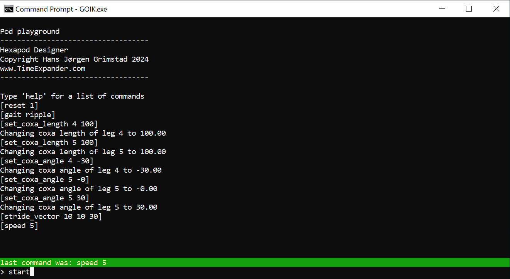
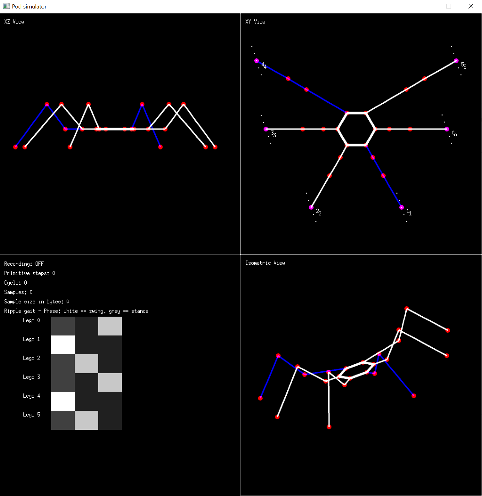

# GOIK hexapod designer

This is a tool for simulating and designing hexapods, octopods, or any pod you can imagine (as long as it is using limbs with three degrees of freedom and the inverse kinematics equations have a solution)

Any leg orientations is ok, any number of legs is ok, any combination of coxa, femur and tibia lenghts is ok. You can even mix and match with different style legs and leg anchor points and orientations on the same pod, since the kinematics equations are generic.

Hexapods can use tripod, ripple and wave gait. Pods with a different number of limbs are so far limited to wave gait. (Gait transitions are)

I decided to make this tool to be able to iterate faster when designing my own hexapods.

> No promises though. There will be [bugs](https://github.com/hansj66/goik/issues).

It has so far been tested on Mac and Windows

## Kinematics

A description of the forward and inverse kinematics equations used can be found [here](./goik/README.md) along with some info on how to interface Dynamixel servos. (I used my own [ESP32 based dynamixel board](https://github.com/hansj66/automaton-xl320) when testing). The code is servo agnostic, you will only need to specify servo orientation (up/down) + range if you plan on recording any motion primitives for use on a microcontroller board.

## Building the simulator

The simulator is written in Go. If you don't have Go installed on your machine, you can download it from [here](https://go.dev/).

Navigate to the goik/goik folder and type:

```sh
>go build
```

This will create an executablecalled "GOIK.exe" on windows or a GOIK executable on Mac.

## Usage

GOIK will open a command shell and a graphical XZ/XY and isometric view along with a visualization of the current gait pattern

Type "Help" in the command shell to get a list of commands. There are 6 different preloaded models that can be played with to get a feel for the simulator. 

### Example session

1. Select preloaded model #3
1. select ripple gait
1. change the length of the coxa segment of the two front limbs to 100mm
1. change the default coxa_angles of the two front legs
1. Define a stride in a given direction that repeats 10 times
1. Set walking speed to 5 (range is 1-10)

```sh
>reset 1
>gait ripple
>set_coxa_length 4 100
>set_coxa_length 5 100
>set_coxa_angle 4 -30
>set_coxa_angle 5 30
>stride_vector 10 10 30
>speed 5
>start
>revert
```




The simulator allows for loading & saving of pods as well as recording of motion sequences and exporting motion primitives in a servo agnostic way. These can be stored on a microcontroller and chained / replayed given a trigger on any controller. 


## Experimental stuff

I have experimented with streaming servo positions over UDP as well as recording motion primitives for playback on a microcontroller. Consider this part of GOIK as _experimental_

## Future work

There are _issues_ and functionality that is missing / flaky. Since this is a hobby project, I can't make any promises when and if these will be fixed. I am making this code public as is.

## Youtube

During development, I have made a few youtube videos about the project. These can be found here:

* [Hexapod Robot Kinematics - part 1 (Simulator)](https://www.youtube.com/watch?v=xthlPREFzRA)
* [Hexapod Robot Kinematics - part 2 (Entering meat-space)](https://www.youtube.com/watch?v=5gxnghpX1Pk)
* [Hexapod Robot Kinematics - part 3 (Espressif Dynamixel driver)](https://www.youtube.com/watch?v=Cd0urj7UFsw)
*[Hexapod Robot Kinematics - part 4 (First meatspace demo - warts and all)](https://www.youtube.com/watch?v=RQcAUK3_wCM)
* [Hexapod Robot Kinematics - part 5 (massive update and demo)](https://www.youtube.com/watch?v=xjMBvChrAeI)
* [Custom Robot Transport Case (using Shadowfoam)](https://www.youtube.com/watch?v=giUUoQKJEms) (This video is probably the best showcase of recorded motion primitives)
* [3D Printing a Self Righting Balancing Robot](https://www.youtube.com/watch?v=FlivZoxygZM) (Not hexapod related, but is using a variant of the same controller board that I use for my hexapods)
