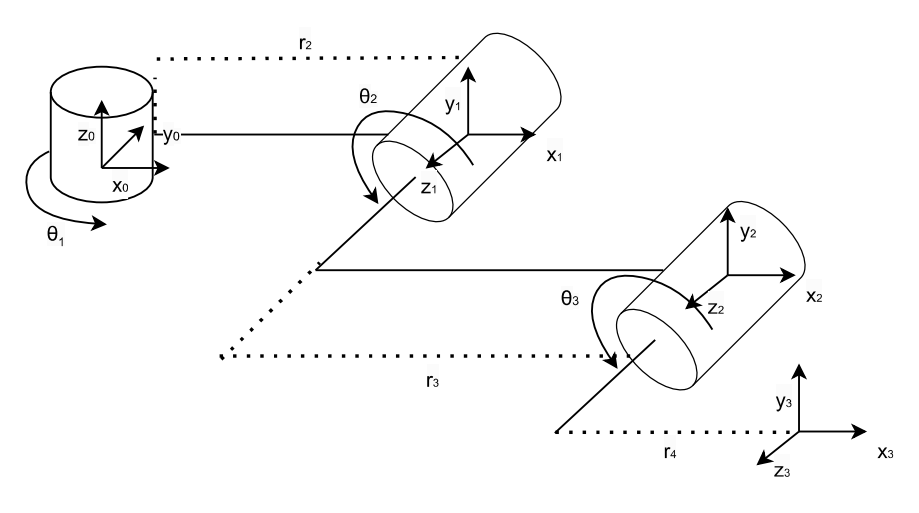
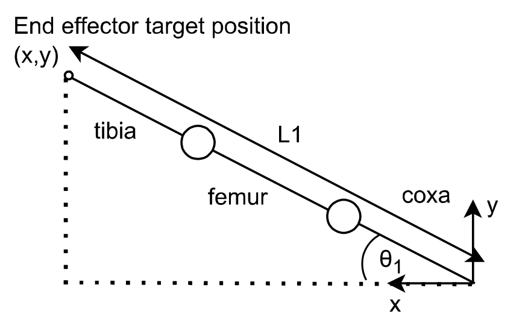
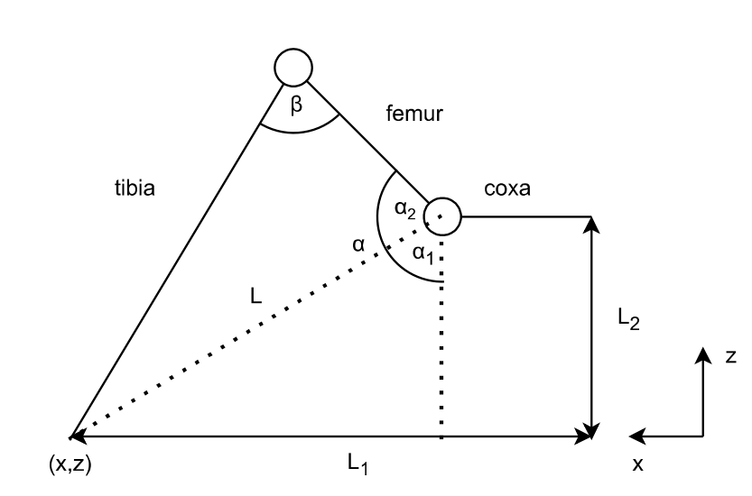
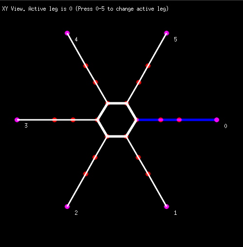
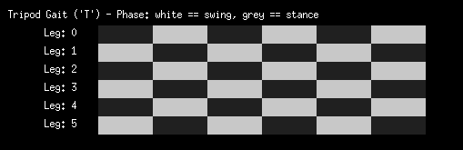
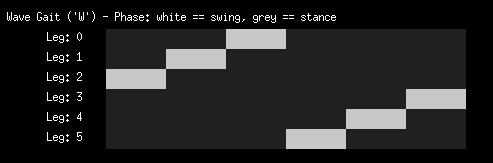
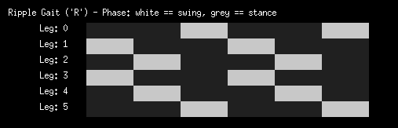

# Go Pod

Go Pod is written in Go and should be runnable on macOS, Windows and Linux. The visualization is using [Ebitengine](https://ebitengine.org/), which is a 2D game engine for Go. Some OS variants require additional installation steps. More information can be found [here](https://ebitengine.org/en/documents/install.html).

## Dynamixel specific stuff

I designed this application as a design helper for my own dynamixel based pod projects. The forward and inverse kinematics bits of the code is not really tied to any particular servo types, but it is assumed that the servo midpoint is at 0 degrees.

Servos can be controlled either directly from this application or via a separate controller board (in which case, you will have to write custom firmware for the specific board. You can find the inverse kinematics equations in [solver.go](./solver/solver.go). These should be easily ported to other languages / platforms)

## Servo Addressing Scheme
Dynamixel are serial servos and each servo requires its own unique address. The default addressing scheme is as follows.

|Leg|Coxa Id|Femur Id|Tibia Id|
|---|-------|--------|--------|
|0| 1| 2| 3|
|1| 4| 5| 6|
|2| 7| 8| 9|
|3| 10| 11| 12|
|4| 13| 14| 15|
|5|16|17|18|

## Hardware interfaces

Dynamixel servos are serial servos that can be daisy chained. Communication is half duplex using a single data line. Robotis offers several commercial variants, both for controlling the servos via a computer or from a microcontroller. See the [DYNAMIXEL Quick Start](https://emanual.robotis.com/docs/en/dxl/dxl-quick-start-insert/) for more info.

Or you can roll your own by bolting a buffer / line driver to your favourite microcontroller. (I have used the [NC7WZ241](https://rocelec.widen.net/view/pdf/r9bmizc4je/FAIRS42890-1.pdf?t.download=true&u=5oefqw) in past projects, but this seem to to have reached end of life and is no longer produced)

> Tip: If you are using the [OpenCM 9.04](https://emanual.robotis.com/docs/en/parts/controller/opencm904/) board stand-alone or with the [OpenCM 485 expansion board](https://www.robotis.us/opencm-485-expansion-boar/), it is possible to use this as a replacement for the [U2D2](https://emanual.robotis.com/docs/en/parts/interface/u2d2/). Install [OpenCM IDE](https://emanual.robotis.com/docs/en/software/opencm_ide/getting_started/) and flash the board with the smartTosser.ino sketch). This enables you to connect to the servos using the [Dynamixel Wizard](https://emanual.robotis.com/docs/en/software/dynamixel/dynamixel_wizard2/) from your computer (handy for changing servo IDs).

## Typical kinematic diagram for a pod leg

This kinematic diagram describes a typical pod leg (Servo horns should face in the positive z- direction of their respective reference frame
).

The first leg segment is the _coxa_. This has a rotation angle $\theta_1$ around $z_0$. The length of the coxa is $r_2$.

The second leg segment is the _femur_. This has a rotation angle $\theta_2$ around $z_1$. The length of the femur is $r_3$.

The third leg segment is the _tibia_. This has a rotation angle $\theta_3$ around $z_2$. The length of the tibia is $r_4$.

The end effector is located at the origin of the $[x_3,y_3,z_3]$ reference frame.

$r_1$ is assumed to be of zero length in this pod example. (If $\theta1, \theta2$ and $\theta3$ are all zero, $x_0, x_1$ and $x_3$ all align in the same direction at $z_0=0$ and $y_0=0$).

## Forward kinematics

All leg segments rotate around z in their corresponding reference frame. We will therefore rely on the z rotation matrix for all joints:

$`R_{z}(\theta) = \begin{bmatrix}
Cos(\theta) & -Sin(\theta) & 0\\
Sin(\theta) & Cos(\theta) & 0\\
0 & 0 & 1
\end{bmatrix}
`$

By multiplying the rotation matrix with a projection matrix, we can get a new rotation matrix that also reflect the rotation of the reference frame compared to the previous reference frame.

If the reference frames are perfectly aligned, the projection matrix is the identity matrix (which will not change the rotation matrix). The exception in this case is the projection of the femur reference frame to the coxa reference frame. This gives us the following projection matrices:

$`P_{coxa}^{femur} = \begin{bmatrix}
1 & 0 & 0\\
0 & 0 &-1\\
0 & 1 & 0\\
\end{bmatrix}
`$

$`P_{femur}^{tibia} = P_{tibia}^{end effector} \begin{bmatrix}
1 & 0 & 0\\
0 & 1 &0\\
0 & 0 & 1\\
\end{bmatrix}
`$

The final rotation matrix for each frame is:

$`R(\theta) = R_{z}(\theta) \times P`$

A displacement vector describes the offset between reference frames. The displacement vector has to be valid for all values of $\theta$.

For this kinematic diagram, the displacements vectors are :

$`D_{coxa}= \begin{bmatrix}
r_2 \times cos(\theta_1)\\
r_2 \times sin(\theta_1)\\
0
\end{bmatrix}
`$

$`D_{femur}= \begin{bmatrix}
r_3 \times cos(\theta_2)\\
r_3 \times sin(\theta_2)\\
0
\end{bmatrix}
`$

$`D_{tibia}= \begin{bmatrix}
r_4 \times cos(\theta_3)\\
r_4 \times sin(\theta_3)\\
0
\end{bmatrix}
`$

We can then compose homgeneous transformation matrices for transforming from one frame to the next.

From frame zero to frame 1 :

$`H^0_1= \begin{bmatrix}
R_{coxa}[0,0] & R_{coxa}[0,1] & R_{coxa}[0,2] & D_{coxa}[0]\\
R_{coxa}[1,0] & R_{coxa}[1,1] & R_{coxa}[1,2] & D_{coxa}[1]\\
R_{coxa}[2,0] & R_{coxa}[2,1] & R_{coxa}[2,2] & D_{coxa}[2]\\
0 & 0 & 0 & 1
\end{bmatrix}
`$

From frame 1 to frame 2 :

$`H^1_2= \begin{bmatrix}
R_{femur}[0,0] & R_{femur}[0,1] & R_{femur}[0,2] & D_{femur}[0]\\
R_{femur}[1,0] & R_{femur}[1,1] & R_{femur}[1,2] & D_{femur}[1]\\
R_{femur}[2,0] & R_{femur}[2,1] & R_{femur}[2,2] & D_{femur}[2]\\
0 & 0 & 0 & 1
\end{bmatrix}
`$

From frame 2 to frame 3 :

$`H^2_3= \begin{bmatrix}
R_{tibia}[0,0] & R_{tibia}[0,1] & R_{tibia}[0,2] & D_{tibia}[0]\\
R_{tibia}[1,0] & R_{tibia}[1,1] & R_{tibia}[1,2] & D_{tibia}[1]\\
R_{tibia}[2,0] & R_{tibia}[2,1] & R_{tibia}[2,2] & D_{tibia}[2]\\
0 & 0 & 0 & 1
\end{bmatrix}
`$

Since each leg originates at a different [X,Y,Z] coordinate in the base reference frame, we also introduce a transformation matrix for the base reference frame. The origin of this frame is the center of the robot body.

Example: Here each leg origin is arranged at a distance _d_ separated by _a_ degrees in the X/Y plane at Z=0 in the base reference frame.

$`H^{base}_0= \begin{bmatrix}
cos(a) & -sin(a) & 0 & d \times cos(a)\\
sin(a) & cos(a) & 0 & d \times  sin(a)\\
0 & 0 & 1 & 0\\
0 &  0 &  0 &  1
\end{bmatrix}
`$

If we want to know the end effector's position in the $[x_{base},y_{base},z_{base}]$ reference frame, we simply take the matrix product of all the homogeneous transformation matrices and extract the X,Y,Z values from the resulting matrix from row 0-2 in the rightmost column.

$`H^{base}_3 = H^{base}_0 \times H^0_1 \times H^1_2 \times H^2_3`$

End effector coordinates (after matrix multiplication) in the base reference frame:

$`H^{base}_3: \begin{bmatrix}
. & . & . & x\\
. & . & . & y\\
. & . & . & z\\
. &  . &  . &  .
\end{bmatrix}
`$

## Inverse kinematics

### Pod leg top view

The angle $\theta_1$ is given by the formula

(1) $`\theta_1 = arctan(\frac{y} {x})`$

### Pod leg side view

(2) $`L=\sqrt(L_2^2+(L_1-coxa)^2)`$

(3) $`\alpha_1=arccos(\frac{L_2}{L})`$

(4) $`\alpha_2=arccos(\frac{tibia^2-femur^2-L^2}{-2 \times femur \times L})`$

(5) $`\alpha = \alpha_1 + \alpha_2`$

(6) $`\beta=arccos(\frac{L^2 - tibia^2 - femur^2}{-2 \times tibia \times femur})`$

$\theta_2 = 90 - \alpha`$

$\theta_3 = 180 - \beta`$

>Note: It is assumed that the neutral position (centered servos) are at 0 degrees. If this is not the case, a zero offset has to be introduced.

## Gaits

Moving the pod involves one or more of the legs of the robot being lifted off the ground and being moved in a desired direction. These legs are in the "swing phase". The legs that provide stabilization and are still on the ground are said to be in the "stance phase".

Given the position of a leg on the robot, the length of the leg segments and the angles of coxa, femur and tibia joints, we can know the exact location of the end effector (the tip of the robot leg) in XYZ space in the base reference frame. This is called forward kinematics.

Assuming that the positive y direction is the robot forward direction we can specify a new target position of y+\<stride length\> and obtain a new coordinate in XYZ space in the base reference frame. From this (and the lengths of the leg segments) we can then use inverse kinematics to find the servo angles neccesary for moving the end effector to the new location.

The legs in the swing phase can not move directly to the new position, but have to be lifted from the ground before they move. Instead of just providing a new target location we will provide a path that ends in the target location and interpolate to obtain a set of intermediate end effector locations on the path.

As the legs in the swing phase move forward, the coxas of the legs in the stance phase will move back towards their original position. 

Example layout of a hexapod

We can define the folling gait patterns
### Tripod gait

### Wave gait

### Ripple gait

